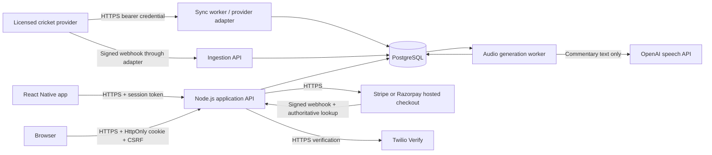

# Architecture and database guide

This is a production-oriented foundation, not a completed commercial release or a security certification. The running demo uses a persistent embedded PostgreSQL engine (PGlite). Production requires a separately operated PostgreSQL service and the infrastructure described in SECURITY.md.

## Boundaries

- Mobile clients never receive provider API keys, database credentials, encryption keys, or payment secrets.
- Match list and detail requests query the internal database. They do not call the cricket provider.
- Sync jobs validate a canonical feed, upsert stable provider IDs, reject older snapshots, and update timestamps atomically. One lease limits concurrent sync workers.
- Payment redirects do not grant premium access. Verified webhooks reconcile authoritative subscription state, then update entitlements in a transaction. Event uniqueness prevents duplicate application.
- SQL values are parameterized. Personal records are always scoped to the authenticated user ID; the caller cannot select another account.
- Production database TLS verifies certificates; application HTTPS is required. Development deliberately allows localhost/LAN HTTP.

## Table inventory and index strategy

The schema is in `migrations/001_initial.sql`. Primary keys and unique constraints create indexes automatically. Additional indexes support observed access patterns rather than indexing every column.

| Domain | Tables | Principal indexes / constraints |
| --- | --- | --- |
| Identity | users, sessions, auth_tokens | Unique HMAC mobile/email lookups; unique hashed tokens; active sessions by user/expiry; expiry cleanup indexes |
| OTP | otp_challenges, development_sms | Phone/time, expiry and user indexes; five attempts; encrypted local test codes |
| Audio | audio_clips | Unique content fingerprint; match/sequence, pending-job and stable delivery indexes |
| Archives | historical_profiles, achievements, ranking_snapshots, ranking_entries, cricket_records | Provider/profile, format/category, snapshot dimensions/date, unique rank/entity |
| Privacy | user_preferences, consent_events, privacy_requests | One preferences row per user; consent and request history by user/time |
| Security & jobs | audit_events, rate_limits, email_outbox, job_leases | Actor/time audit reads; rate-limit key; expiry cleanup; outbox status/due time; unique lease name |
| Provider operations | providers, sync_runs, webhook_events | Run history by provider/time; unique provider/event ID; license expiry and retention fields |
| Cricket reference | countries, venues, teams, players, competitions, seasons, squads | Unique season names per competition; squad composite keys; player/team lookups |
| Matches | matches, match_teams | Unique provider/match mapping; status/start-time; season/start-time; team/match; freshness/retention index |
| Detailed cricket | innings, deliveries, batting_figures, bowling_figures, standings | Unique innings number; unique provider delivery ID and sequence; player history indexes |
| Reader features | articles, favorites | Article publish-time and provider indexes; unique user/match favorite |
| Notifications | notification_devices, notification_jobs | Unique token hash; user/device; dedupe key; pending jobs by schedule |
| Billing | plans, billing_customers, subscriptions, checkout_requests, payments, refunds | Customer ownership; provider/subscription uniqueness; user/status/expiry; user/idempotency key; provider/payment uniqueness; payment history |
| Advertising | ad_placements, ad_campaigns, ad_creatives, ad_daily_metrics | Approved creatives by placement; campaign joins; creative/day aggregates |
| Forecasting | prediction_models, match_predictions | Model/version uniqueness; match/model/input-time uniqueness; recent predictions by match |

### Implemented versus reserved schema

All migrations through 004 are required. Legacy auth_tokens/password columns are retained for upgrade compatibility; no password or email authentication routes remain.

Operational in this build: phone OTP/identity/session/privacy/audit/outbox/rate-limit tables; audio queue and archive tables; providers/sync/matches/teams/match_teams/articles/favorites; plans/customers/subscriptions/checkouts/payments/webhook events; ad placements/campaigns/creatives.

The canonical feed currently persists validated scorecard/commentary snapshots in `matches.payload` JSONB. Relational innings/deliveries/player figures, reference competitions/squads/standings, push notifications, refunds, ad analytics, and trained prediction storage are schema foundations. Their complete population, administration, and delivery pipelines are not implemented. Do not interpret an existing table as a working feature.

A provider-specific mapper must populate relational cricket records when stable player/event IDs and licensed schemas are known. Delivery identity must be the provider event ID, not simply over.ball: wides/no-balls can repeat display labels. Keep `legal_balls` as an integer for arithmetic.

## Query and scale guidance

- Lists cap response sizes. Matches accept status, limit (1–100), and offset; news/payment lists are bounded.
- Start with the database-backed rate limiter. At higher traffic, move counters to a shared Redis service with equivalent atomic semantics and add edge abuse limits.
- Add Redis/CDN caches only to public sports content; never cache account/session/payment responses publicly.
- For large histories, use keyset pagination and partition deliveries, audit events, and notification logs by time after measuring query plans.
- Add a transactional event outbox and SSE/WebSockets for score updates once provider cadence and concurrency targets are known.
- Use EXPLAIN ANALYZE on realistic datasets. The present indexes are a starting design, not a verified capacity claim.

## Differentiation roadmap

Delivered: transparent update timestamps and delay flags, personal match following, privacy controls, contextual sponsor slots with an ad-free entitlement, and an explained scoring-pace projection.

Prioritize next: licensed delivery-level timelines; spoiler-free mode; configurable wicket/innings alerts and quiet hours; low-bandwidth/offline match summaries; accessible score announcements; Hindi and regional-language editorial support; player comparisons; women's/domestic cricket discovery. Each needs product decisions, licensed content, device testing and measurable acceptance criteria.

Predictive models come after a licensed historical dataset: use time-based train/test separation, publish calibration and Brier scores, measure data leakage, monitor drift, and show uncertainty. The current pace projection is arithmetic, not an AI model, win probability, betting tip, or claimed advantage over Cricbuzz.
